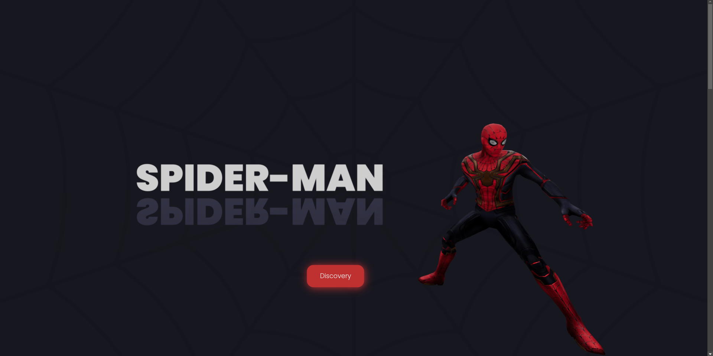

# Spiderman 3D UI



A simple project that mix 3d elements and web-design. The project was made with next.js, react-three/fiber @react-three/drei and Tailwind CSS.
This is a [Next.js](https://nextjs.org/) project bootstrapped with [`create-next-app`](https://github.com/vercel/next.js/tree/canary/packages/create-next-app).

##  Project Folders
### public

Folder with fonts, models and images.

### models

Folder with 3d models converted to Javascript files.


## Getting Started

First, run the development server:

```bash
npm run dev
# or
yarn dev
# or
pnpm dev
# or
bun dev
```

Open [http://localhost:3000](http://localhost:3000) with your browser to see the result.

You can start editing the page by modifying `app/page.js`. The page auto-updates as you edit the file.

This project uses [`next/font`](https://nextjs.org/docs/basic-features/font-optimization) to automatically optimize and load  a custom Google Font.


## Credits

Spider-Man 3D Model

Title: Spider-man (Spider-man: No way Home)
Author:[Spiderware](https://sketchfab.com/Spiderware)
License:[CC-BY-4.0](http://creativecommons.org/licenses/by/4.0/)
Source: [Link](https://sketchfab.com/3d-models/spider-man-spider-man-no-way-home-2cb11e591cc44357bffc6e23931a78e2)

